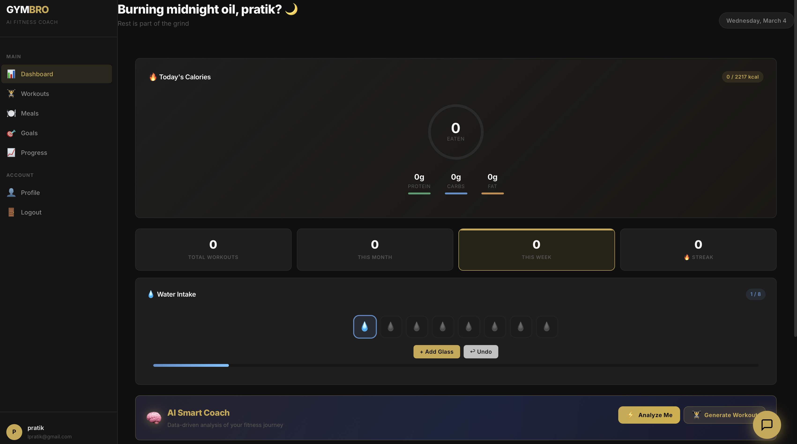
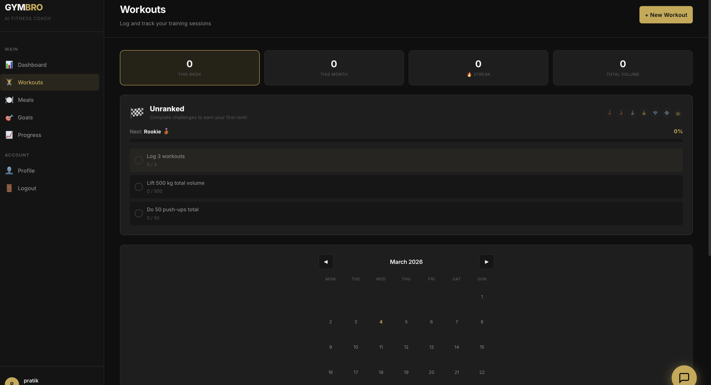
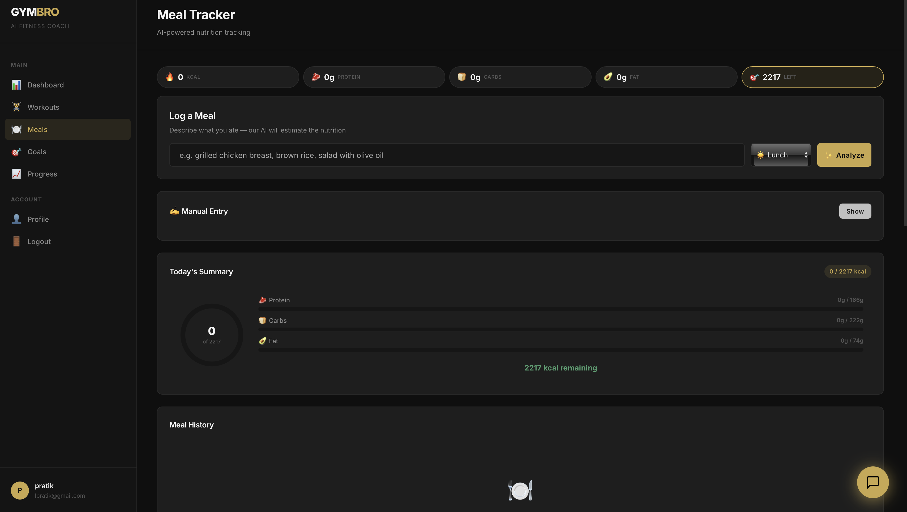
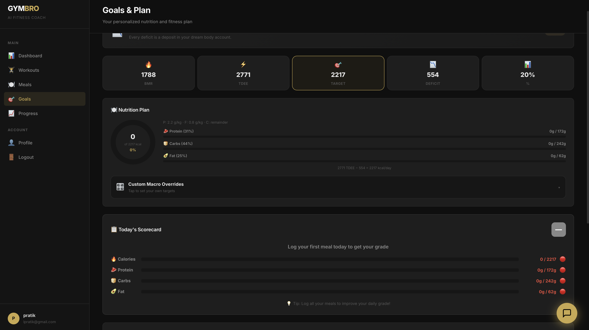
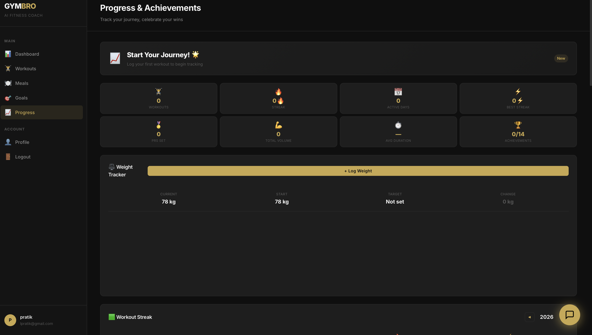

# 🏋️ GYMBRO — AI Fitness Tracker & Coach

A modern, progressive web app (PWA) for fitness tracking with AI-powered coaching, workout planning, and nutrition analysis. Built with **FastAPI**, **MongoDB**, **Vanilla JS**, and **Google Gemini AI**.

---

## 🌟 Features

### 📊 **Dashboard**
- Real-time fitness overview with daily streaks
- Personal records (PRs) tracking
- Weight & water intake logging
- AI Smart Coach analysis card



### 💪 **Workouts**
- Log exercises with sets, reps, and weight
- Track volume, intensity, and progression
- Muscle group distribution analytics
- PR detection and celebration



### 🍽️ **Meals**
- Log meals with AI-powered calorie estimation
- Macro nutrient tracking (protein, carbs, fat)
- Daily calorie goals and progress
- Meal calendar view with heatmap



### 🎯 **Goals**
- Set short and long-term fitness goals
- Goal types: weight loss, muscle gain, endurance, flexibility
- Progress tracking toward targets
- Milestone achievements



### 📈 **Progress**
- Activity heatmap (workout streaks & consistency)
- Performance metrics and trends
- Weight progression charts
- Detailed stats breakdown



### 🤖 **AI Smart Coach**
- **Data-driven fitness analysis** with 10+ analytical rules
- Performance scoring (0-100) with letter grades
- Muscle distribution analysis
- AI-enhanced natural language coaching summaries
- Personalized workout plan generation
- Weak muscle group identification

### 💬 **AI Chat Assistant**
- Science-backed fitness coaching
- Nutrition and meal guidance
- Exercise form tips and alternatives
- Evidence-based Q&A with study references

### 🏋️ **Workout Templates**
- Pre-built training splits: Full Body, Upper/Lower, Push/Pull/Legs
- Beginner-friendly progressions
- Advanced periodization options

---

## 🛠️ Tech Stack

| Layer | Technology |
|-------|-----------|
| **Backend** | FastAPI (Python 3.14), Async/await |
| **Database** | MongoDB (Local), Motor async driver |
| **Frontend** | Vanilla JS, Chart.js 4.4.7, Inter font |
| **AI** | Google Gemini 2.0 Flash API |
| **PWA** | Service Worker v10, Manifest.json, Offline mode |
| **Auth** | JWT tokens, bcrypt password hashing |
| **Styling** | Custom CSS with dark theme, gold accents (#c9a84c) |

---

## 🚀 Quick Start

### Prerequisites
- Python 3.14+
- MongoDB (local or cloud)
- Node.js (optional, for development)

### Installation

```bash
# Clone repository
cd GYMBRO

# Create virtual environment
python -m venv venv
source venv/bin/activate  # On Windows: venv\Scripts\activate

# Install dependencies
pip install -r requirements.txt

# Configure environment
cp .env.example .env
# Edit .env and add your GEMINI_API_KEY (optional)

# Start MongoDB
brew services start mongodb-community  # macOS
# or: mongod  # Windows/Linux

# Run server
uvicorn app.main:app --reload --host 0.0.0.0 --port 8000
```

### Access the App
- **Frontend**: http://localhost:8000
- **API Docs**: http://localhost:8000/docs (Swagger UI)

---

## 📁 Project Structure

```
GYMBRO/
├── app/
│   ├── main.py                 # FastAPI app entry point
│   ├── config.py               # Settings & environment
│   ├── database.py             # MongoDB connection
│   ├── models/                 # Pydantic data models
│   │   ├── user.py
│   │   ├── workout.py
│   │   ├── meal.py
│   │   └── goal.py
│   ├── routes/                 # API endpoints
│   │   ├── auth.py             # Login, register
│   │   ├── workout.py          # Workout CRUD
│   │   ├── meal.py             # Meal logging
│   │   ├── progress.py         # Heatmap, stats
│   │   ├── coaching.py         # AI coaching tips
│   │   └── ...
│   ├── services/               # Business logic
│   │   ├── smart_coach.py      # 🤖 AI analysis engine (850+ lines)
│   │   ├── ai_service.py       # Gemini calorie estimation
│   │   ├── chatbot.py          # AI chat responses
│   │   ├── coaching.py         # Science-backed tips
│   │   └── ...
│   ├── schemas/                # Pydantic request/response schemas
│   └── utils/
│       ├── security.py         # JWT tokens, password hashing
│       └── ...
├── static/
│   ├── index.html              # SPA main template
│   ├── js/app.js               # Frontend logic (3200+ lines)
│   ├── css/style.css           # Styling & animations (4770+ lines)
│   ├── sw.js                   # Service Worker (offline support)
│   ├── manifest.json           # PWA metadata
│   └── icons/                  # App icons (192x192, 512x512)
├── screenshot/                 # UI screenshots
│   ├── dashboard.png
│   ├── workouts.png
│   ├── meals.png
│   ├── goals.png
│   └── progress.png
├── requirements.txt            # Python dependencies
├── .env                        # Environment variables (add GEMINI_API_KEY)
└── README.md                   # This file
```

---

## 🔑 API Endpoints

### Authentication
- `POST /api/auth/register` — Create new account
- `POST /api/auth/login` — Login (returns JWT token)
- `GET /api/auth/me` — Get current user

### Workouts
- `POST /api/workouts/` — Log a workout
- `GET /api/workouts/` — List user's workouts
- `GET /api/workouts/stats` — Workout statistics
- `GET /api/workouts/calendar` — Workouts by month

### Meals
- `POST /api/meals/` — Log a meal (with AI calorie estimation)
- `GET /api/meals/` — List user's meals
- `GET /api/meals/calendar` — Meals by month

### Goals
- `POST /api/goals/` — Create a goal
- `GET /api/goals/` — List user's goals
- `PUT /api/goals/{id}` — Update goal progress

### Progress
- `GET /api/progress/heatmap` — Activity heatmap (yearly view)
- `GET /api/progress/stats` — Overall statistics

### 🤖 AI Smart Coach (NEW)
- `POST /api/coaching/smart-analysis?days=30` — Comprehensive fitness analysis with AI summary
- `GET /api/coaching/generate-workout` — AI-generated personalized workout plan
- `GET /api/coaching/tips` — Personalized coaching tips

### Chat
- `POST /api/chat/` — Send message to AI coach
- `GET /api/chat/history` — Chat conversation history

---

## 🤖 AI Features Explained

### Smart Coach Analysis
The AI Smart Coach analyzes **all your data** (workouts, meals, weight, water, PRs) and provides:

1. **Performance Score (0-100)** with letter grades (S, A, B, C, D, F)
2. **Score Breakdown**:
   - Consistency (30%) — workout frequency & streaks
   - Nutrition (25%) — meal logging & macros
   - Balance (15%) — muscle group distribution
   - Progression (15%) — PR rate & volume increase
   - Weight (10%) — progress toward goal
   - Hydration (5%) — water intake

3. **Data-Driven Insights**:
   - ✅ Wins — What you're doing great
   - 💡 Insights — Opportunities to optimize
   - ⚠️ Warnings — Areas needing attention

4. **AI Enhancement** (when API key available):
   - Natural language coaching summary
   - Personalized bonus tips
   - Gemini 2.0 Flash generates in <10s with timeout

### Workout Generation
Generates a **personalized weekly workout plan** based on:
- Your training experience (beginner, intermediate, advanced)
- Fitness goal (muscle gain, weight loss, etc.)
- Weak/neglected muscle groups
- Falls back to rule-based templates if AI quota exhausted

### Meal Calorie Estimation
- Analyzes meal description (e.g., "grilled chicken with rice")
- Returns estimated calories, macros, and nutrition breakdown
- Supports fallback database for common foods

---

## 📊 Database Collections

| Collection | Purpose |
|-----------|---------|
| `users` | User profiles, goals, preferences |
| `workouts` | Exercise logs with sets, reps, weight |
| `meals` | Meal logs with calories, macros |
| `weight_logs` | Daily weight tracking |
| `water_logs` | Daily water intake |
| `personal_records` | PR history & achievements |
| `achievements` | Milestone unlocks |
| `exercises` | 170+ default exercises (seeded) |
| `goals` | User fitness goals & progress |
| `ai_cache` | Cached AI responses (meal estimates) |

---

## 🎨 Frontend Architecture

### Single Page App (SPA)
- **Vanilla JavaScript** (no frameworks)
- **Chart.js 4.4.7** for data visualization
- **Dark theme** with gold accents (#c9a84c)
- **Inter font** for clean typography
- **Responsive design** (mobile-first)

### Navigation
- Dashboard, Workouts, Meals, Goals, Progress, Profile
- AI Chat FAB (floating action button)
- Collapsible sidebar on mobile

### State Management
- LocalStorage for user session
- Fetch API with JWT auth headers
- Real-time form validation

---

## 🔐 Security

✅ **JWT Authentication** — Tokens expire after 30 days  
✅ **Bcrypt Password Hashing** — Secure password storage  
✅ **CORS Protection** — API access controlled  
✅ **Input Validation** — Pydantic schemas for all requests  
✅ **Rate Limiting** — Gemini API with timeout protection  

---

## 📱 Progressive Web App (PWA)

- ✅ Service Worker (v10) — Offline support
- ✅ Manifest.json — Installable on home screen
- ✅ App icons (192x192, 512x512)
- ✅ Cache versioning — Auto-updates CSS/JS
- ✅ Works on iOS and Android

### Install Instructions
1. Open GYMBRO in your browser
2. Click "Install" or "Add to Home Screen"
3. Use offline-first features

---

## 🧠 AI API Key Setup

GYMBRO uses **Google Gemini 2.0 Flash** for AI features. To enable AI enhancements:

1. Get a free API key: https://aistudio.google.com/apikey
2. Add to `.env`:
   ```
   GEMINI_API_KEY=your_key_here
   ```
3. Restart the server

**Note**: Free tier has rate limits. If exhausted, features gracefully fall back to rule-based analysis.

---

## 🚦 Recent Updates (Current Session)

✅ **Fixed AI Integration**
- Migrated from deprecated `google.generativeai` to `google.genai` package
- Added 10-second timeouts to prevent hanging
- Graceful fallback to rule-based analysis when API quota exhausted
- Updated all 4 AI services (smart_coach, ai_service, coaching, chatbot)

✅ **Code Polishing**
- Added humanized comments throughout codebase
- Removed unused imports
- Optimized error handling
- Added this comprehensive README

---

## 🐛 Troubleshooting

### Server won't start
```bash
# Make sure MongoDB is running
brew services list | grep mongodb

# Kill any old processes on port 8000
lsof -ti:8000 | xargs kill -9

# Start fresh
uvicorn app.main:app --reload
```

### AI features slow/hanging
- Check if API key is valid
- Verify 10-second timeout is in code
- Check server logs: `tail -f /tmp/gymbro.log`

### Frontend not updating
- Clear browser cache (Cmd+Shift+R)
- Clear service worker: Open http://localhost:8000/clear-cache
- Hard refresh

---

## 📝 Development Guidelines

### Adding a New Feature
1. Create endpoint in `app/routes/`
2. Add business logic to `app/services/`
3. Define schema in `app/schemas/`
4. Update frontend `static/js/app.js`
5. Add styling to `static/css/style.css`

### Code Style
- **Python**: Follow PEP 8, use type hints
- **JavaScript**: Use vanilla JS, avoid global variables
- **Comments**: Write humanized, context-aware comments

### Testing
```bash
# API endpoints
curl -H "Authorization: Bearer {token}" http://localhost:8000/api/workouts/

# Syntax check
node -c static/js/app.js
```

---

## 📄 License

MIT License — Feel free to use for personal or commercial projects.

---

## 🎯 Future Roadmap

- [ ] Push notifications for workout reminders
- [ ] Social leaderboards
- [ ] Wearable device integration (Apple Watch, Fitbit)
- [ ] Advanced analytics dashboard
- [ ] Export data to PDF/CSV
- [ ] Workout form video tutorials
- [ ] Mobile app (React Native)

---

## 👨‍💻 Built with 💪 for fitness enthusiasts

Questions? Issues? Suggestions?  
Open an issue or contribute! GYMBRO is community-driven.

---

**Happy training! 🏋️💪**
